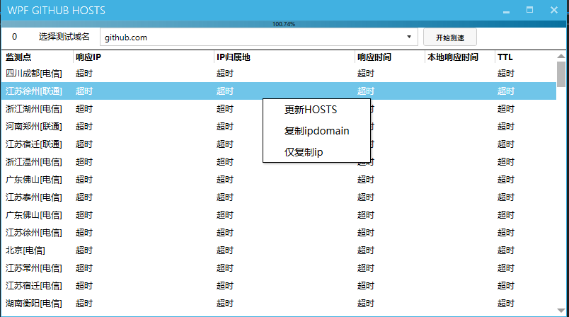

# **Wpf_github_hosts**

解决访问GitHub慢的问题

- 需要管理员权限，如果要改hosts

TODO List

- [x] 同一个ip只次ping
- [ ] 检测进度显示
  - 进度条显示 :white_check_mark:
  - 进度条精确显示:persevere:
    - 更精细的进度条显示:persevere:
- [x] hosts管理
  - 添加hosts:white_check_mark:
  - 更新hosts:white_check_mark:
  - 删除hosts:white_check_mark:
  - 显示已有hosts:white_check_mark:
- [ ] 运行信息显示
  - 简短正在运行信息显示:white_check_mark:
  - 详细信息显示:neutral_face:
  - error信息显示:neutral_face:
- [ ] UI美化
- [ ] 非致命性hosts文件出错修复