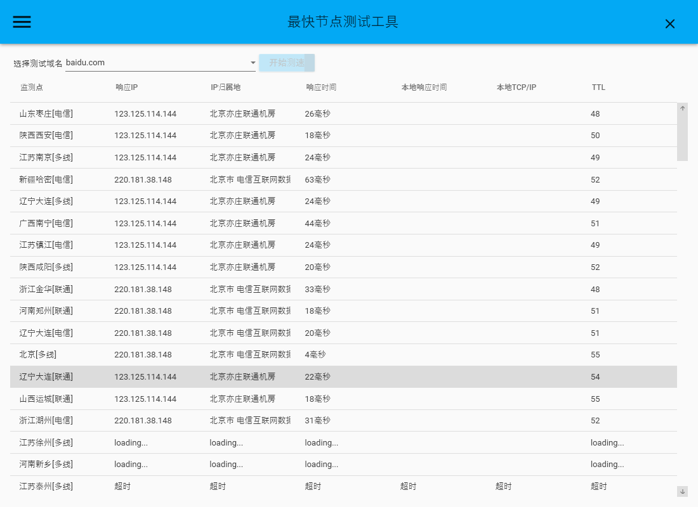

> 别fork, 别start了, 已经停止开发了  
> 相关加速方法  
> https://steampp.net/  
> https://greasyfork.org/zh-CN/scripts/412245-github-%E5%A2%9E%E5%BC%BA-%E9%AB%98%E9%80%9F%E4%B8%8B%E8%BD%BD  
> 本项目原理： https://zhuanlan.zhihu.com/p/107334179  
> https://www.bilibili.com/read/cv10607526/  

# **Wpf_github_hosts**  

> 明年（也）一定完（不）成（:cry:）

解决访问GitHub慢的问题

- 需要管理员权限，如果要改hosts

TODO List

- [x] 同一个ip只次ping

- [ ] 检测进度显示
  
  > 目前计划这个想砍了
  
  - 进度条显示 :persevere:
  - 进度条精确显示:persevere:
    - 更精细的进度条显示:persevere:
  
- [x] hosts管理
  - 添加hosts:white_check_mark:
  - 更新hosts:white_check_mark:
  - 删除hosts:white_check_mark:
  - 显示已有hosts:white_check_mark:
  
- [ ] 运行信息显示
  - 简短正在运行信息显示:white_check_mark:
  - 详细信息显示:neutral_face:
  - error信息显示:neutral_face:
  
- [x] UI美化

- [x] 非致命性hosts文件出错修复

- [x] TCP/IP 测试

- [ ] 酸酸乳 批量测试

  - 批量ip导入

- [ ] 测试任务可停止

- [ ] 测试线路可选择

- [ ] 配置文件

  - 存于自身:bangbang:
  - 存于配置文件:bangbang:
